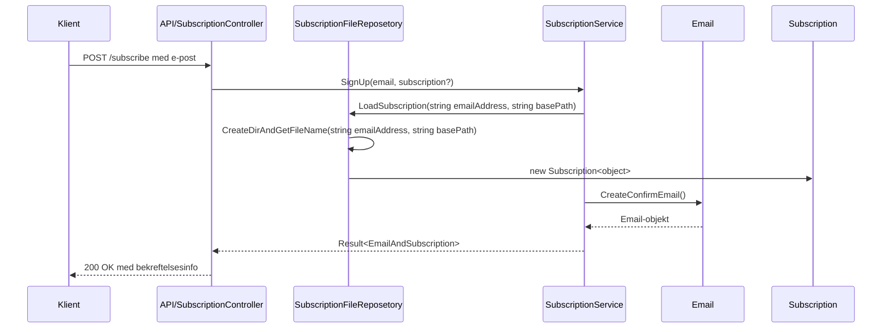

## 📌 Introduksjon til prosjektet og læringsoppsummering

Velkommen som utvikler på Terje sitt prosjekt! Dette prosjektet er en modulbasert, 
objektorientert webapplikasjon hvor hovedmålet er å håndtere nyhetsabonnement (typisk e-postbasert) med registrering, 
verifisering og statusadministrasjon. 

Alt er strukturert for å være utvidbart og lett å vedlikeholde, 
og koden er skrevet etter prinsipper som **Pure Code** og tydelig separasjon av ansvar.

### 🔍 Hva vi har lært så langt

1. **Objektorientering og strukturering av kode**
   - Vi har laget egne domeneklasser som `EmailAddress`, `Subscription`, `Email`, og `SubscriptionService`.
   - Dette gir god kapsling av logikk og gjør det lettere å endre én del uten å påvirke resten.

2. **Validering og flytkontroll**
   - `EmailAddress` har en `IsValid()`-metode for enkel og gjenbrukbar validering.
   - `SubscriptionService.SignUp()` håndterer ulike tilstander (`SignedUp`, `Verified`, `Unsubscribed`) 
   med tydelig flyt basert på `SubscriptionStatus` enum.

3. **Bruk av `Result<T>`-mønster**
   - Alle operasjoner returnerer et `Result<T>`-objekt som enten representerer en suksess (`Ok`) eller en feil (`Fail`). 
   Dette gir forutsigbar og ryddig feilbehandling.

4. **Testbar og ren kode**
   - Vi har jobbet med å gjøre logikken uavhengig av infrastruktur som database og e-postserver, 
   slik at den kan testes isolert.
   - Eksempel: `Email.CreateConfirmEmail()` er bare en fabrikkmetode som returnerer et `Email`-objekt, 
   uten å faktisk sende noe.

---

## 🧠 Viktige punkter i arkitekturen

- **Tydelig separasjon av ansvar**  
  Domenelogikken ligger i `Core.DomainModel`. 
  Ingen sideeffekter (som database eller e-post) skjer her – det gjør koden enklere å forstå og teste.

- **Statemachine-lignende tilnærming**  
  `Subscription.Status` styres og oppdateres eksplisitt. F.eks. hvis brukeren er `Unsubscribed`, 
  endrer vi status til `SignedUp` og genererer en ny verifiseringskode med `RegenerateVerificationCode()`.

- **Immutable design med kontrollert mutasjon**  
  De fleste egenskaper i modellene er `get; private set;`, 
  og kan kun endres via dedikerte metoder som `ChangeStatus()` og `Verify()`.

---

## 🔄 Hvis vi vil bruke database eller sende ekte e-post

### 💾 Persistens (database)
Hvis vi ønsker å lagre eller hente `Subscription`-data fra en database, vil man koble seg på her:
- **Inngangspunkt:** `SubscriptionService.SignUp()`
- **Hva du må gjøre:** I stedet for å jobbe direkte med `Subscription? subscription` som et parameter, 
må du hente det fra en database basert på `emailAddressStr` hvis den finnes – og lagre endringer tilbake igjen etterpå.

```csharp
// Eksempel på hvor man ville koblet på
data subscription = subscriptionRepository.FindByEmail(emailAddressStr); // ny kode
```

### 📧 Ekte e-postutsendelse
Hvis du vil sende ekte e-post i stedet for å bare generere `Email`-objekter:
- **Inngangspunkt:** Etter `Email.CreateConfirmEmail(...)` i `SubscriptionService.SignUp()`
- **Hva du må gjøre:** Kall et `IEmailSender.Send(Email mail)`-interface eller liknende som implementeres med f.eks. SMTP.

```csharp
var mail = Email.CreateConfirmEmail(...);
emailSender.Send(mail); // ny kode
```

---

## 📆 Sekvensdiagram og forklaring

### A: Tegne abonnement (`POST /subscribe`)



**Forklaring:**
- Klienten sender en forespørsel til API-et med e-post.
- API-et sender kall til `SubscriptionService.SignUp()`.
- Hvis e-posten er gyldig og ny/ikke-verifisert, genereres en verifiseringskode og en bekreftelses-e-post via `Email.CreateConfirmEmail()`.
- Resultatet returneres til klienten som en bekreftelse.
- Result<T> er en generic som brukes som en felles resultat håndterer

### B: Bekrefte abonnement (`POST /confirm`)

```mermaid
sequenceDiagram
    participant Klient
    participant API (SubscriptionController)
    participant SubscriptionFileRepository
    participant SubscriptionService


    Klient->>API: POST /confirm med kode og e-post
    API->>SubscriptionFileRepository: LoadSubscription(string emailAddress, string basePath) 
    SubscriptionFileRepository->>Mapper
    Mapper->>Subscription
    Subscription->>Mapper
    Mapper->>SubscriptionController
    SubscriptionController->>SubscriptionService: Verify(email, code)
    SubscriptionService-->>API: Result.Success/Fail
    API-->>Klient: 200 OK eller 400 Bad Request
```

**Forklaring:**
- Klienten sender verifiseringskode og e-post.
- API-et sender dette til `SubscriptionService.Verify()`.
- Hvis koden stemmer, markeres abonnementet som verifisert.
- Resultatet returneres til klienten.


## 📦 Oppsummering

Prosjektet er bygd opp for å være fleksibelt og testbart. Du kan lett plugge inn databaser og e-postsystemer uten å endre domenelogikken. 
Dette gir deg som utvikler et solid utgangspunkt for å bygge videre eller koble opp ekte tjenester etter behov.

Velkommen på laget – og spør gjerne hvis noe er uklart!

-->


#   GetNews - Nyhetsbrev-backend
Prosjektet GetNews omhandler utviklingen av en backend-tjeneste for et nyhetsbrev.
Tjenesten tillater brukere å :
* Påmelding av nyhetsbrevet
* Verifisere påmelding ved hjelp av en tilsendt kode via e-post
* Melde seg av nyhetsbrevet.

## Helt overordnet
[Modellering av Prosjektet](./model/getnews.md)


Prosjektet er delt inn i tre hovedkomponenter:
* **API**: Ansvarlig for grensesnitt mot eksterne systemer/frontend
* **Core**: Inneholder kjernelogikken og forretningsreglene
* **Test**: Omfatter enhetstester og integrasjonstester.

### Dataflyt og mønstere
Systemet benytter et mønster for dataflyt som kan visualiseres som:
```mermaid
%% Input/Output(IO) -> Kall til kjerne -> IO
Denne [linken]() Inneholder en mer detaljert forklaring av dataflyten.

```
### Core-laget
[Modellering av hvordan Core fungerer sammen](./model/core.md)
Dette laget implementerer all forretningslogikk for håndtering av abonnementer, verifisering og avmelding

### Test-laget
Se [Modellering av testene](./model/testModel.md) for en visuell oversikt over teststrukturen.
Vårt testregime har oppnådd en testdekning på 99% i kjernelaget, noe som sikrer robusthet og kvalitet i de fleste funksjoner.


Tre prosjekter: 
- API
- Core
- Test

Forklare. Hvorfor? Hva skal hvor?

Ulike modeller og mapping. 

Forklare mønsteret IO -> kalle kjerne -> IO
Ev. IO -> kalle kjerne -> IO -> kalle kjerne -> IO

Vise til video fra youtube


### Core
Se over [Modellering av core](./model/core.md) for å få et visuelt bilde av hvordan testene fungerer.

### Test
Se over [Modellering av testene](./model/testModel.md) for å få et visuelt bilde av hvordan testene fungerer.
Gjennom kjerne testene har vi oppnåd en 99% grundig testing der vi har testet de fleste funksjonene i koden.

##  Directory tree
[Visuell oversikt over mappe treet](./model/tree.md)

```sh
├── GetNews.API
│   ├── ApiModel
│   │   ├── EmailAddress.cs                 # Ansvarlig for sjekk av inn skrevet Emailadresse
│   │   ├── Email.cs                        # Ansvarlig for mottak av Email innhold fra frontend
│   │   ├── SubscriptionSignUp.cs           # Ansvarlig for mottak av Emailadresse for sjekk i Backend
│   │   ├── SubscriptionVerification.cs     # Ansvarlig for mottak av emailadressen og verificationCode
│   │   └── VerificationRequest.cs          # Ansvarlig for videresending av emailadressen og verifikasjonskoden til backend
│   │
│   ├── AppConfig.cs                        # Ansvarlig for å sette BasePath for fillagring
│   ├── appsettings.Development.json
│   ├── appsettings.json
│   ├── GetNews.API.csproj
│   ├── GetNews.API.http
│   ├── Infrastructure
│   │   ├── DummyEmailService.cs            # Lager ett JSON objekt og lagrer det som en fil i Subscription mappen
│   │   └── SubscriptionFileRepository.cs   # Henter JSON objektet fra Riktig fil bestemt av Emailadressen som blir sendt med fra UI
│   │
│   ├── Mapper.cs                           # Inneholder DTO'er som sikrer at riktig dataflyt og at kun ønsket del av JSON ovjektet kommer dit det skal
│   ├── PersistentModel
│   │   └── Subscription.cs                 # Lager innholdet som skal lagres i "Emailen" som blir laget av DummyEmailService.cs
│   │
│   ├── Program.cs                          # Henter inn avhengigheter og lytter etter API kall via MapPost
│   ├── Properties
│   │   └── launchSettings.json
│   │
│   ├── SubscriptionController.cs           # Ansvarlig for Sending og mottak av informasjon til Backend
│   ├── SubscriptionEndpoints.cs            # Alternativ måte å ha em  Router til API om en ønsker (mer dynamisk og ryddigere enn å legge alt i Program) 
│   └── wwwroot                             # Inneholder frontend delen av prosjektet
│   │   └── index.html
│   │
├── GetNews.Core
│   ├── ApplicationService
│   │   └── SubscriptionService.cs          # Håndtering av registering, vertifisering og avmelding
│   ├── GetNews.Core.csproj
│
├── GetNews.Core.Test
│   ├── GetNews.Core.Test.csproj
│   └── SubscriptionServiceTest.cs        
│
├── GetNews.sln
├── GetNewsVSC.code-workspace
└── README.md
```
##  Installasjon av prosjektet
1. Clone the repository
```sh
Using Github Cli
gh repo clone krigjo25/console-ConnectSimulator-cs

Using HTTPS
git clone https://github.com/krigjo25/console-socialmedia-cs-cs

Using SSH
ssh  git@github.com:krigjo25/console-ConnectSimulator-cs.git

```
2.  **Åpne prosjektet**: Åpne prosjektet i et passende utviklingsmiljø (Visual Studio / Rider / Visual Studio Code).
3.  **Kjør prosjektet**: Bygg og kjør prosjektet via ditt valgte IDE.
4. Done!

### Nødvendige krav
For å kjøre prosjektet kreves følgende
* **IDE**: Visual Studio 2019 > / Rider 2020.3
* **.NET**: .NET Core 8.0  og AspNetCore 8.0 >
* **Testrammeverk**:  NUnit 4.3+, NUnit.Analyzer 4.7+, NUnit3TestAdapter 5.0+, .NetTestSdk 17.13+
* **Dokumentasjon**: Swasjbuckle.AspNetCore 6.6 >
* **Visual Studio Code**: For brukere som foretrekker VSC her er en [Anbefalt Arbeidsområde for VSC](https://vscode.dev/profile/github/4c4bde0a91b6c89df4bdfc6f5f022189)

## Oppsumering
?
Gjennom prosjektet har det vært utfordrende å forstå herakiet, og sette seg inn i hvordan fungerer koden. 
Vi løste det med å lage diagrammer som viser mappe herakiet, modellering av klassene, og deres ansvar ved bruk av klasse diagram.
I begynnelsen har det vært en utfordring  med team dynamikk, og tenke som en enhet. Dette løste vi med å ha struktur i koden og spille spill på fredager  30 min -1t,
der vi øver på kommunikasjon og team building.

##  Utvikler notater
Dette prosjektet er representert som et løsningsforslag for denne utfordringen.

Have a glorious day further,
[Kimser91](https://github.com/Kimser91), [krigjo25](https://github.com/krigjo25) & [Emsaso](https://github.com/emsaso)
