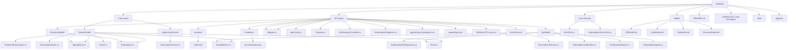

# Visualizing [Directory tree]()

```mermaid

graph TD
    root[GetNews/] --> API[API.csproj]
            API --> APIModel[ApiModel/]
                APIModel --> Email.cs
                APIModel --> EmailAddress.cs
                APIModel --> SubscriptionSignUp.cs
                APIModel --> VertificationRequest.cs
                APIModel --> SubscriptionVertification.cs

        
        API --> IS[InfraStructure/]
            IS --> DummyEmailService.cs
            IS --> SubScriptionFileRepository.cs

        API --> PM[PersistentModel/]
            PM --> Subscription.cs

        API --> Properties[Properties/]
            Properties --> launchSettings.json

        API --> frontend[wwwroot/]
            frontend --> index.html
        
        API --> Mapper.cs
        API --> AppConfig.cs
        API --> Mapper.cs
        API --> Program.cs
        API --> SubScriptionController.cs
        API --> SubscriptionEndpoints.cs
        API --> appsettings.Development.cs
        API --> appsettings.json
        API --> GetNews.API.csproj.cs
    
    root --> Core[Core.csproj]
        Core --> AP[ApplicationService/]
            AP --> SubscriptionService.cs

        Core --> DM[DomainModel/]
            DM --> Email.cs
            DM --> Result.cs
            DM --> SignUpError.cs
            DM --> SignUpError.cs
            DM --> Subscription.cs
            DM --> EmailAddress.cs
            DM --> SubscriptionStatus.cs
            DM --> EmailAndSubscription.cs

    root --> Test[Core.Test.proj]
        Test --> EmailTest.cs
        Test --> SubscriptionServiceTest.cs
        
    root --> Model[Model/]
        Model --> APIModel.md
        Model --> CoreModel.md
        Model --> TestModel.md
        Model --> DirectoryModel.md

    root --> README.md
    root --> GetNewsVSC.code-workspace
    root --> .idea/
    root --> .gitignore
    
```