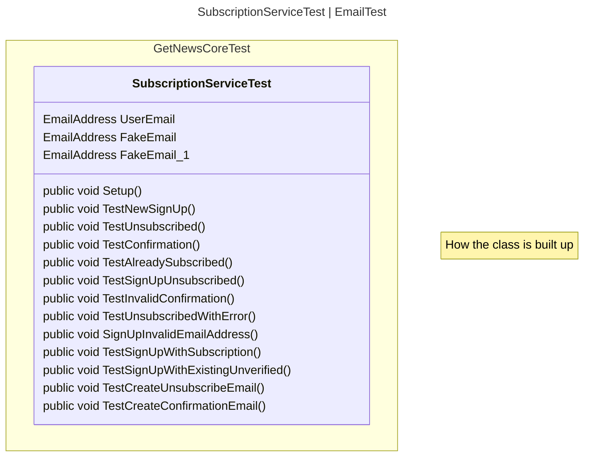
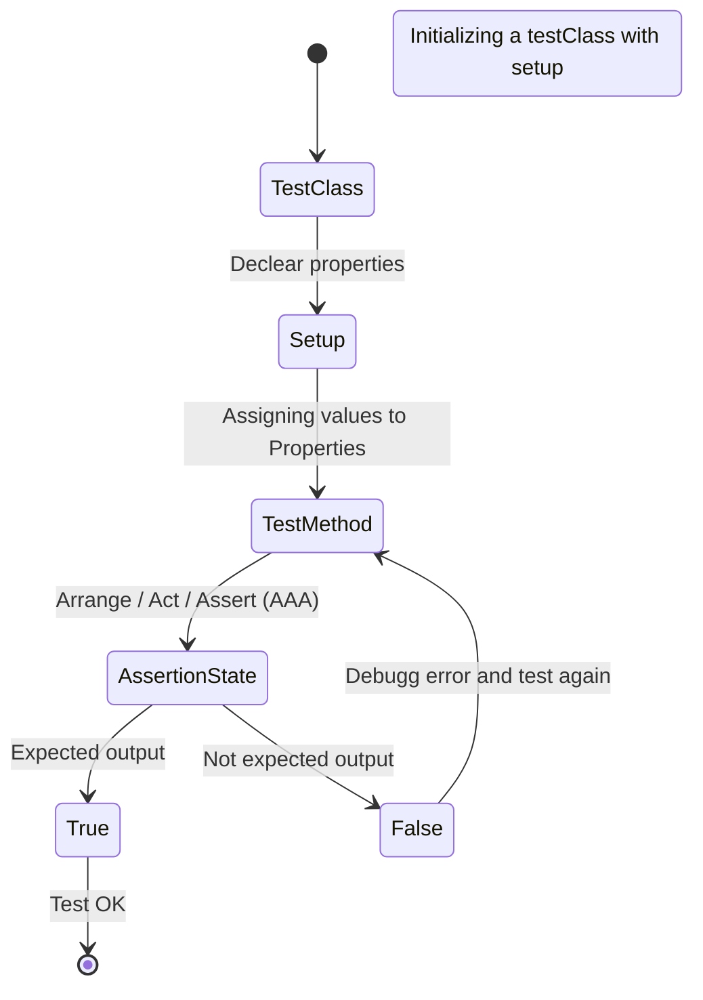
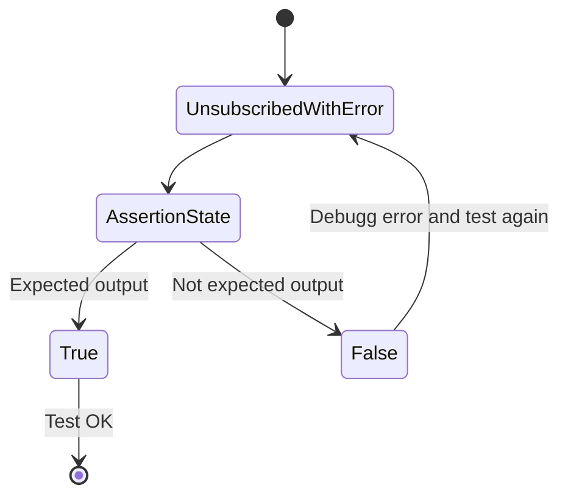

# Visualisering av [SubscriptionServiceTest.cs](../../GetNews.Core.Test/SubscriptionServiceTest.cs)

##  How the Class is built

```mermaid
---
title: SubscriptionServiceTest | EmailTest
---
classDiagram

    note "How the class is built up"
    
    namespace GetNewsCoreTest{

        class SubscriptionServiceTest {
            EmailAddress UserEmail
            EmailAddress FakeEmail
            EmailAddress FakeEmail_1

            public void Setup()
            public void TestNewSignUp()
            public void TestUnsubscribed()
            public void TestConfirmation()
            public void TestAlreadySubscribed()
            public void TestSignUpUnsubscribed()
            public void TestInvalidConfirmation()
            public void TestUnsubscribedWithError()
            public void SignUpInvalidEmailAddress()
            public void TestSignUpWithSubscription()
            public void TestSignUpWithExistingUnverified()  
            public void TestCreateUnsubscribeEmail()
            public void TestCreateConfirmationEmail()
        }
    }
```

## How the test works

```mermaid
stateDiagram-v2
[*] --> TestClass: 
    Notes: Initializing a testClass with setup
        TestClass --> Setup: Declear properties
        Setup --> TestMethod: Assigning values to Properties 
    TestMethod --> AssertionState: Arrange / Act / Assert (AAA)

    AssertionState --> True:Expected output
    AssertionState --> False:Not expected output
        True --> [*]:Test OK
        False --> TestMethod:Debugg error and test again
```

```mermaid
stateDiagram-v2
    [*] --> UnsubscribedWithError
        UnsubscribedWithError --> AssertionState
        
        AssertionState --> True:Expected output
        AssertionState --> False:Not expected output
        
        True --> [*]:Test OK
        False --> UnsubscribedWithError:Debugg error and test again
```