# Visualisering av [SubscriptionServiceTest.cs](../../GetNews.Core.Test/SubscriptionServiceTest.cs)

##  How the Class is built
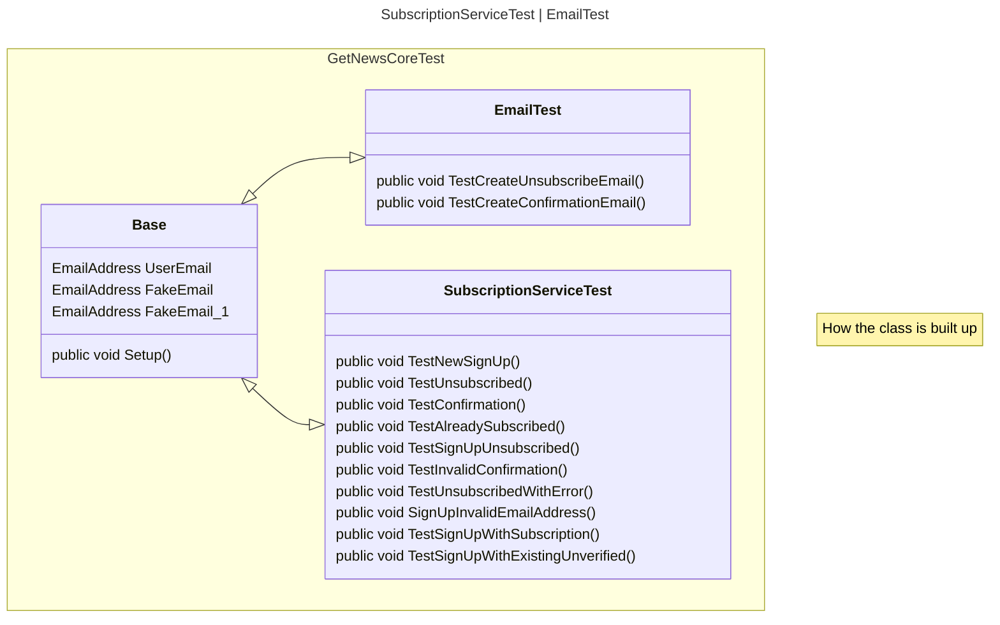

## How to test the methods
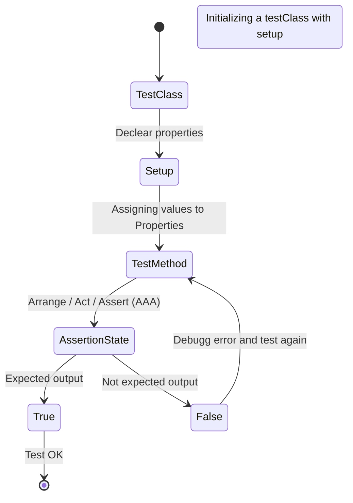

##  TestNewSignUp
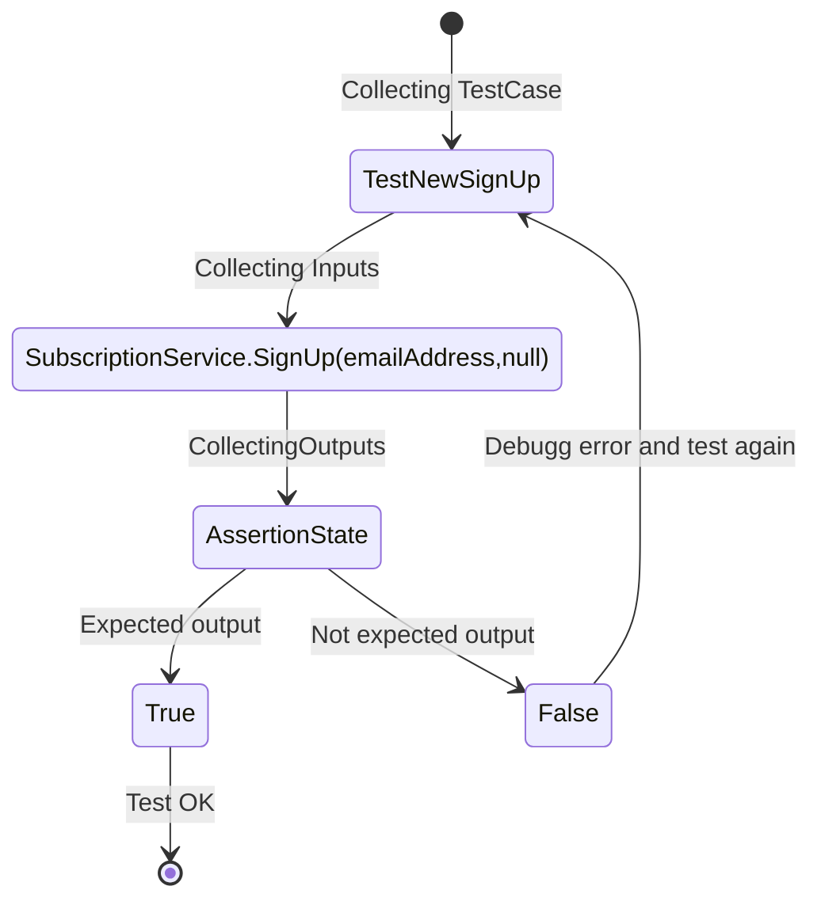
##  TestSignUpWithSubscription
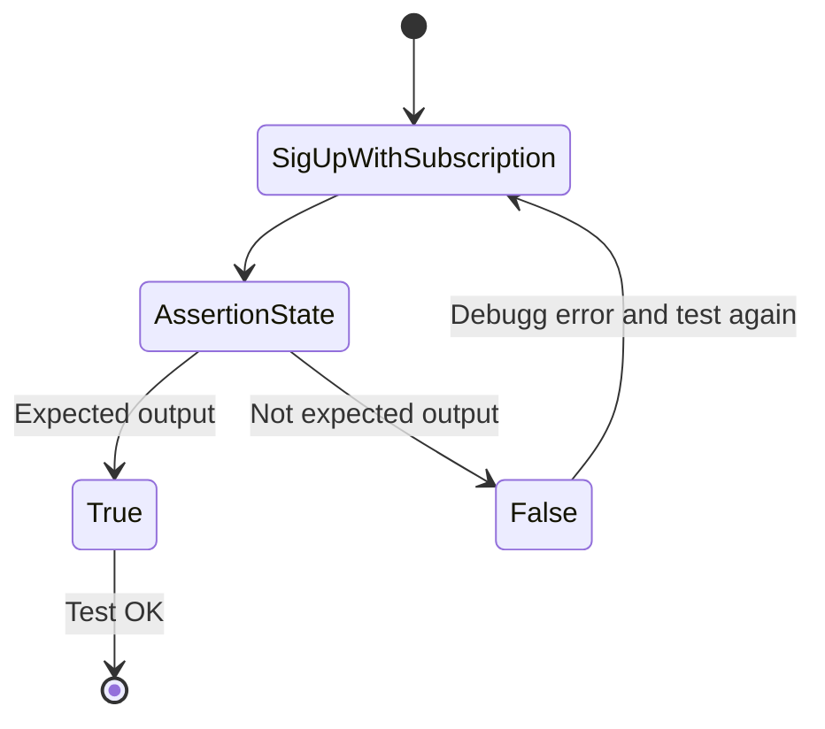

##  TestSignUpInvalidEmailAdress
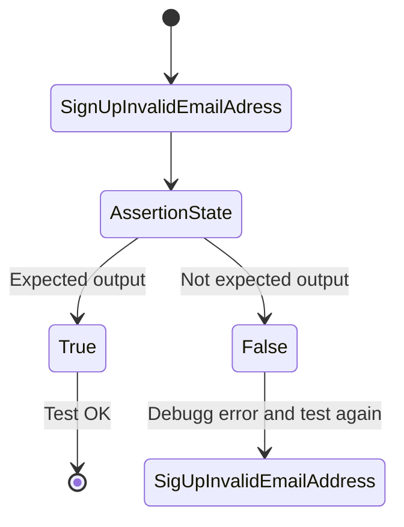

##  TestSignUpAlreadySubscribed
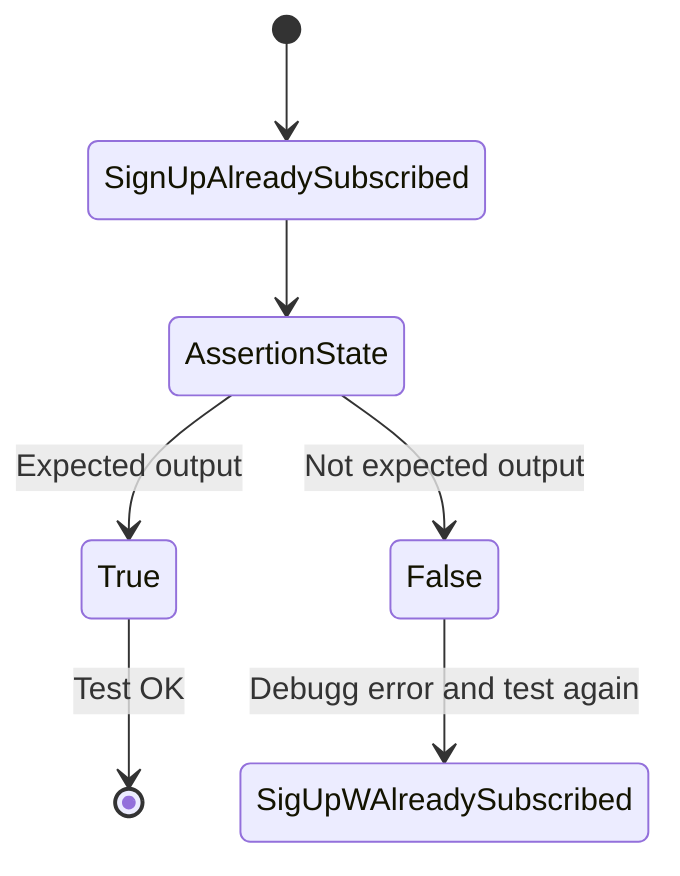

##  TestSignUpUnsubscribed
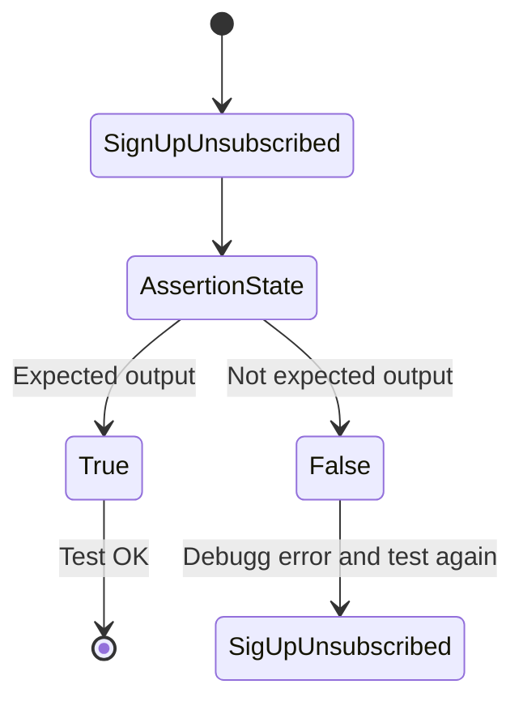

##  TestSignUpWithExistingUnverified
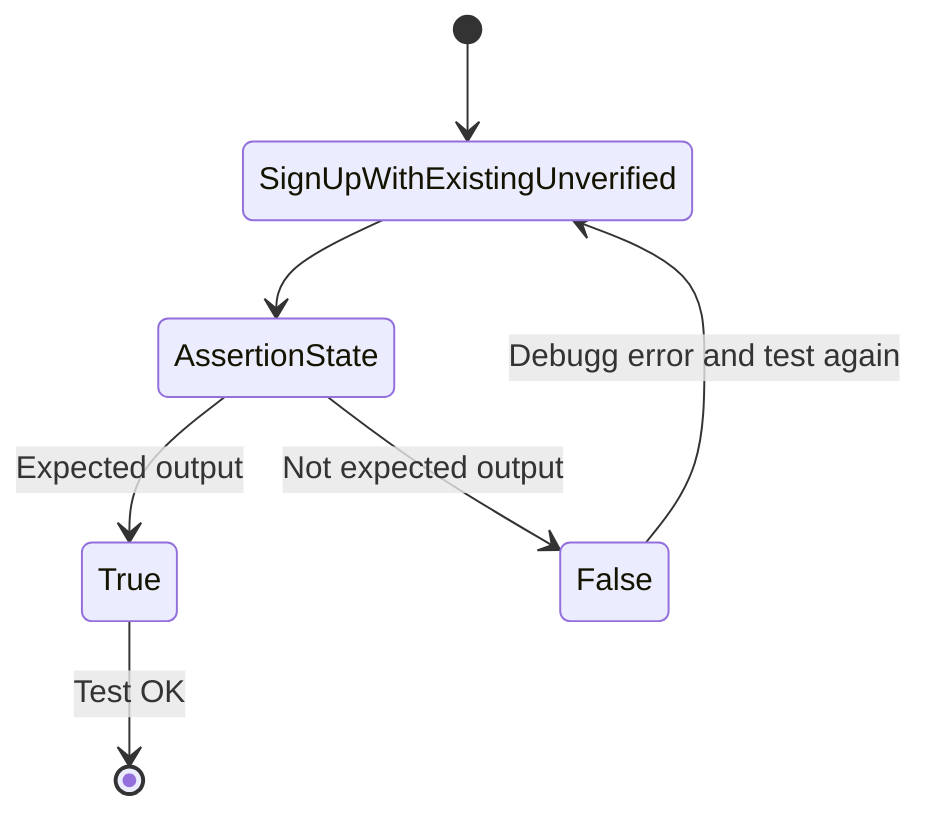

##  TestConfirm
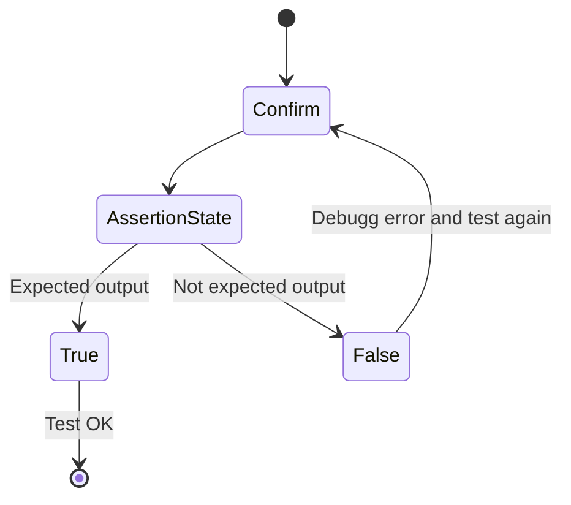

##  TestInvalidConfirm
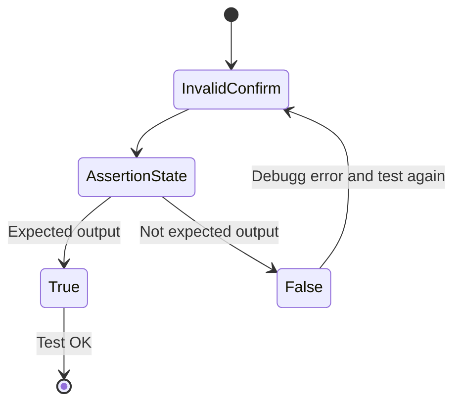

##  TestUnsubscribed

##  TestUnsubscribedWithError
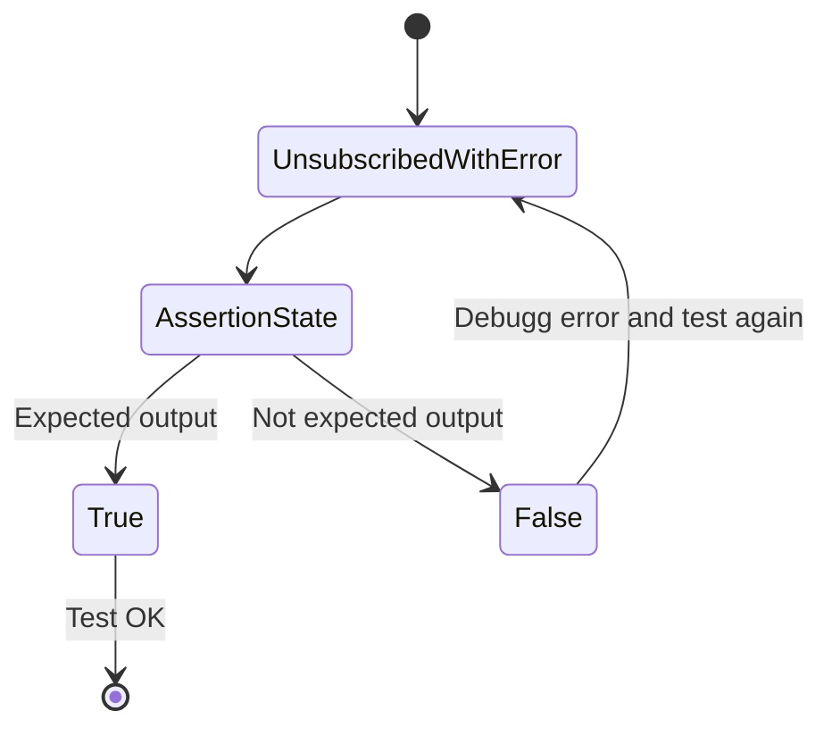