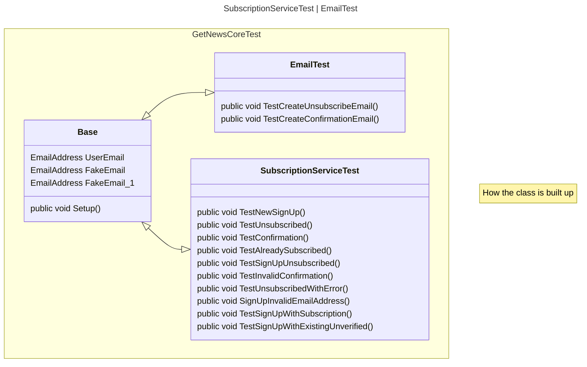
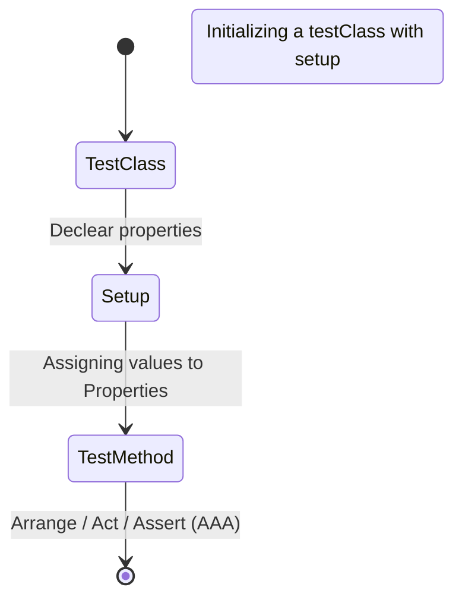
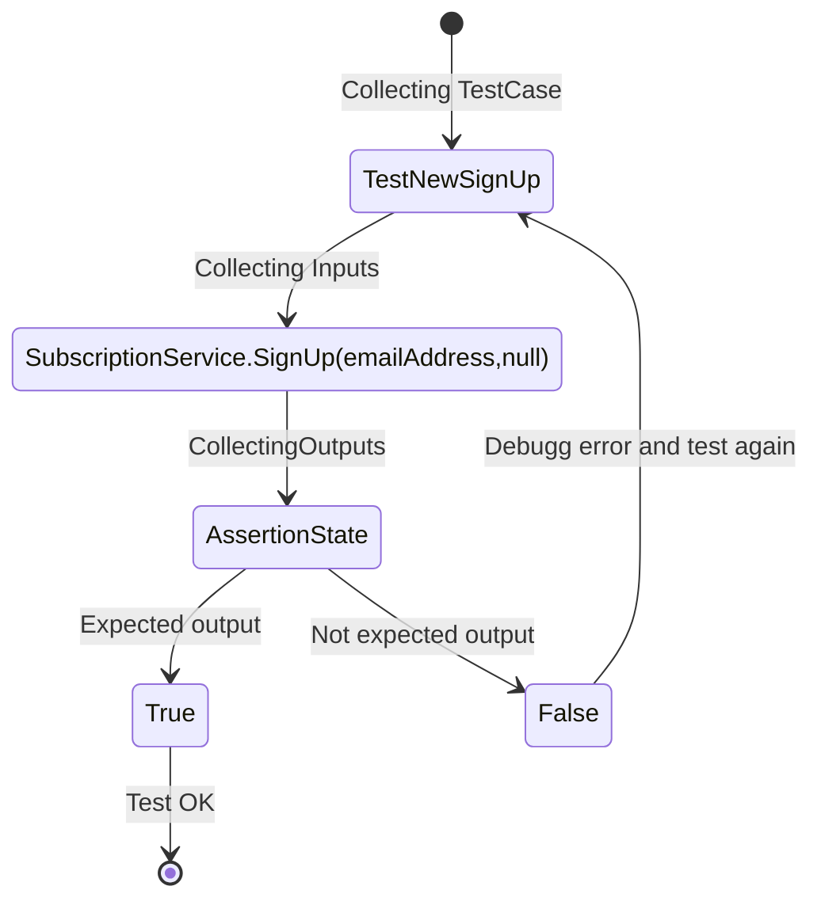
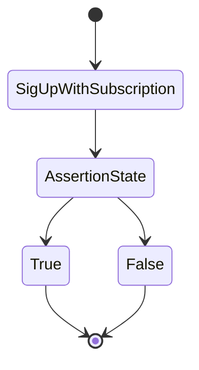
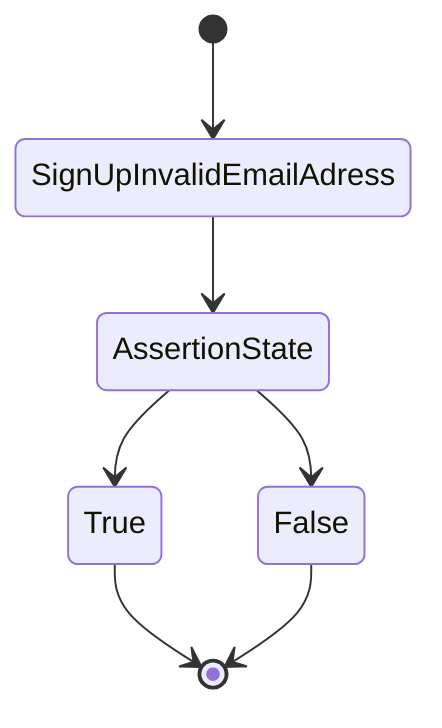
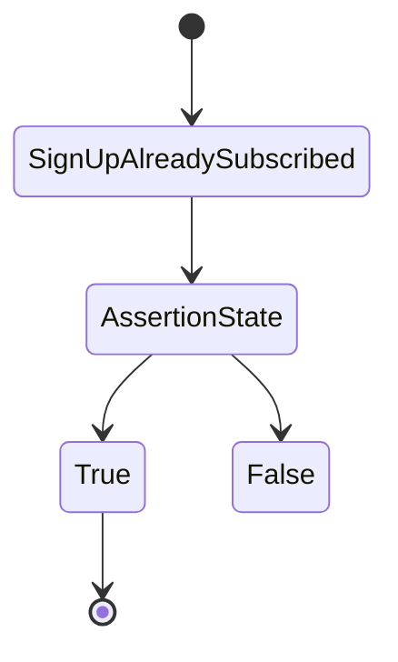
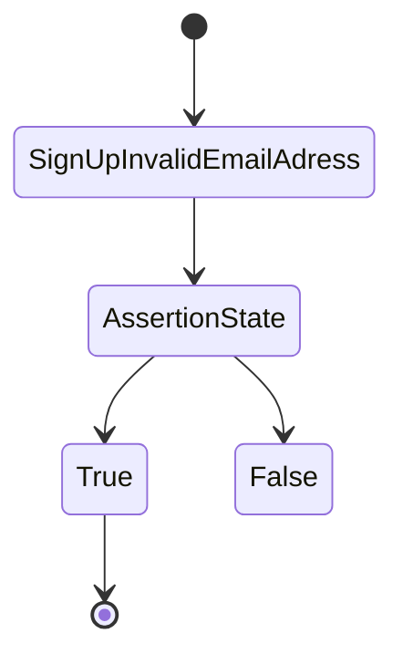

# Visualisering av [SubscriptionServiceTest.cs](../../GetNews.Core.Test/SubscriptionServiceTest.cs)

##  How the Class is built

##  TestNewSignUp

##  TestSignUpWithSubscription

##  TestSignUpInvalidEmailAdress

##  TestSignUpAlreadySubscribed

##  TestSignUpWUnsubscribed

##  TestSignUpWithExistingUnverified

##  TestConfirm

##  TestInvalidConfirm

##  TestUnsubscribed

##  TestUnsubscribedWithError
