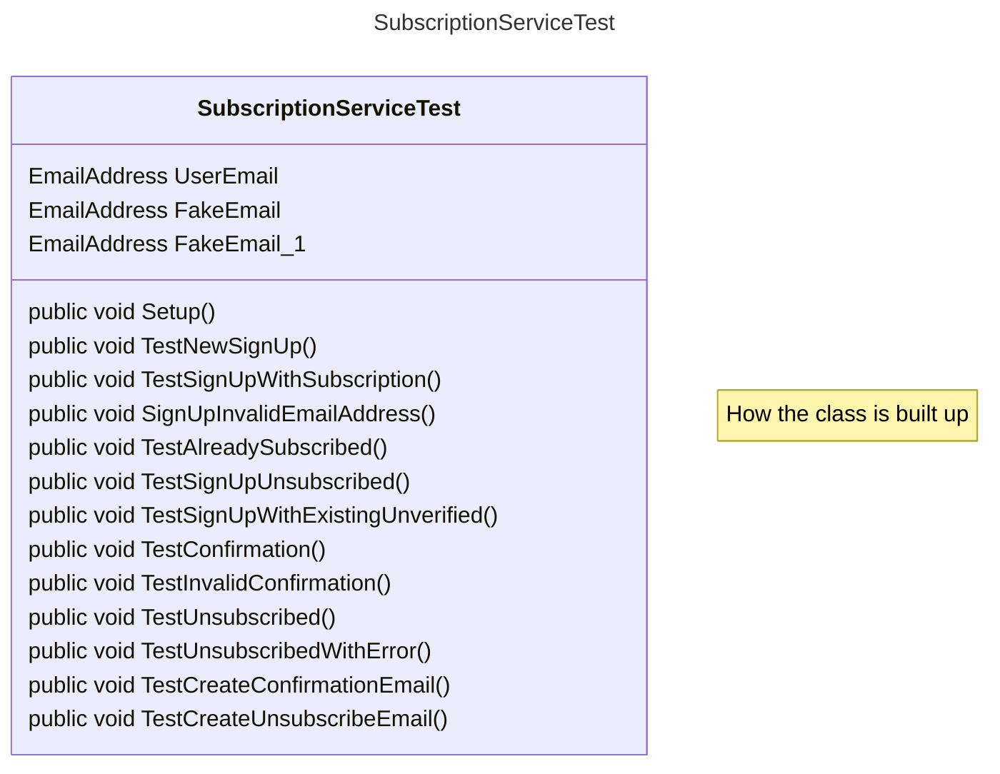
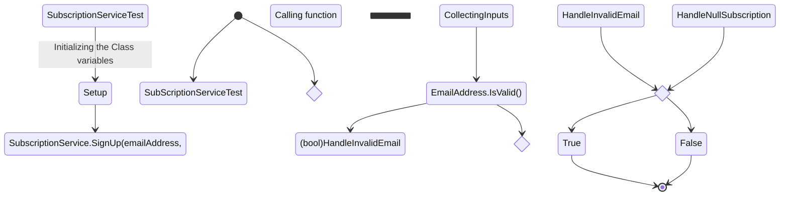

Visualisering av [SubscriptionServiceTest.cs](../../GetNews.Core.Test/SubscriptionServiceTest.cs)


##  How the Class is built

****
##  TestNewSignUp

##  TestSignUpWithSubscription
```mermaid
[*] --> SubScriptionServiceTest.cs

```

##  TestSignUpInvalidEmailAdress
```mermaid
[*] --> SubScriptionServiceTest.cs

```

##  TestSignUpAlreadySubscribed
```mermaid
[*] --> SubScriptionServiceTest.cs

```

##  TestSignUpWUnsubscribed
```mermaid
[*] --> SubScriptionServiceTest.cs

```

##  TestSignUpWithExistingUnverified
```mermaid
[*] --> SubScriptionServiceTest.cs

```

##  TestConfirm
```mermaid
[*] --> SubScriptionServiceTest.cs

```

##  TestInvalidConfirm
```mermaid
[*] --> SubScriptionServiceTest.cs

```

##  TestUnsubscribed
```mermaid
[*] --> SubScriptionServiceTest.cs

```

##  TestUnsubscribedWithError
```mermaid
[*] --> SubScriptionServiceTest.cs

```