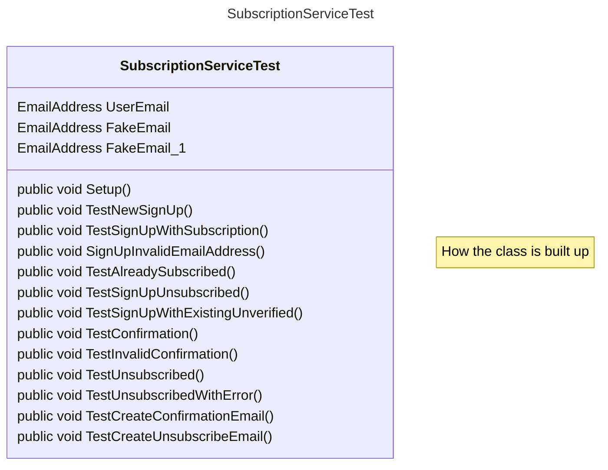
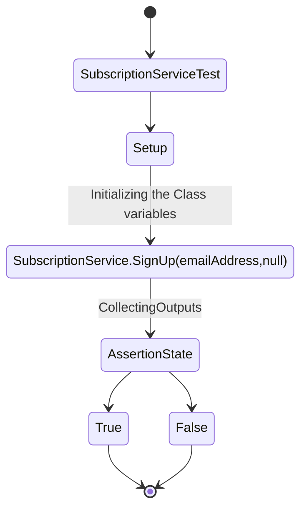

Visualisering av [SubscriptionServiceTest.cs](../../GetNews.Core.Test/SubscriptionServiceTest.cs)


##  How the Class is built


##  TestNewSignUp

##  TestSignUpWithSubscription
```mermaid
[*] --> SubscriptionServiceTest.cs
    
    AssertionState --> True
    AssertionState --> False
    True --> [*]
    False --> [*]

```

##  TestSignUpInvalidEmailAdress
```mermaid
[*] --> SubscriptionServiceTest.cs
****
    AssertionState --> True
    AssertionState --> False
    True --> [*]
    False --> [*]

```

##  TestSignUpAlreadySubscribed
```mermaid
[*] --> SubscriptionServiceTest.cs

    AssertionState --> True
    AssertionState --> False
    True --> [*]
    False --> [*]

```

##  TestSignUpWUnsubscribed
```mermaid

[*] --> SubscriptionServiceTest.cs

    AssertionState --> True
    AssertionState --> False
    True --> [*]
    False --> [*]

```

##  TestSignUpWithExistingUnverified
```mermaid
[*] --> SubscriptionServiceTest.cs

    AssertionState --> True
    AssertionState --> False
    True --> [*]
    False --> [*]

```

##  TestConfirm
```mermaid
[*] --> SubscriptionServiceTest.cs

    AssertionState --> True
    AssertionState --> False
    True --> [*]
    False --> [*]
```

##  TestInvalidConfirm
```mermaid
[*] --> SubscriptionServiceTest.cs

    AssertionState --> True
    AssertionState --> False
    True --> [*]
    False --> [*]
```

##  TestUnsubscribed
```mermaid
[*] --> SubscriptionServiceTest.cs

    AssertionState --> True
    AssertionState --> False
    True --> [*]
    False --> [*]
```

##  TestUnsubscribedWithError
```mermaid
[*] --> SubscriptionServiceTest.cs

    AssertionState --> True
    AssertionState --> False
    True --> [*]
    False --> [*]
```